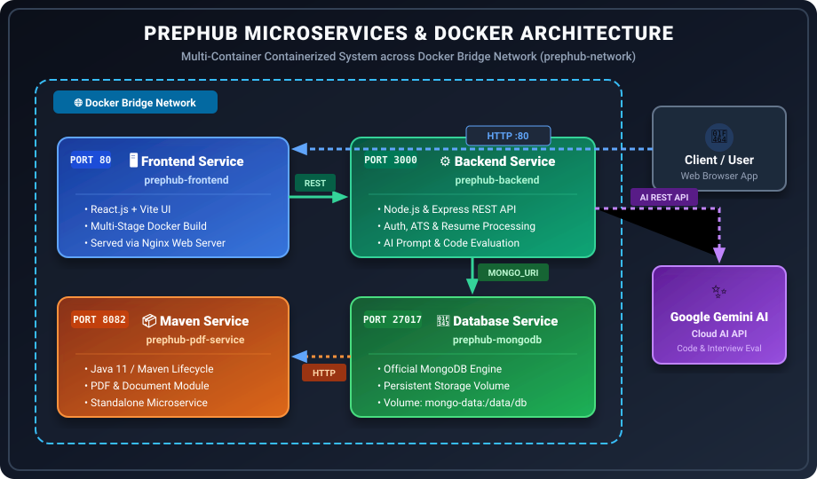
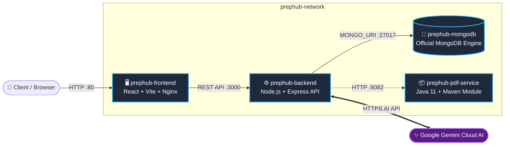
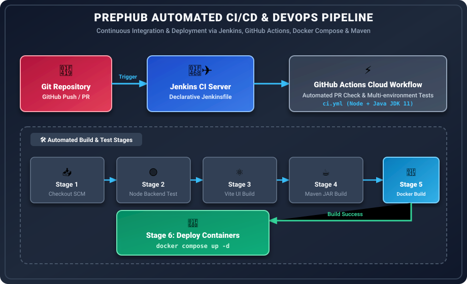
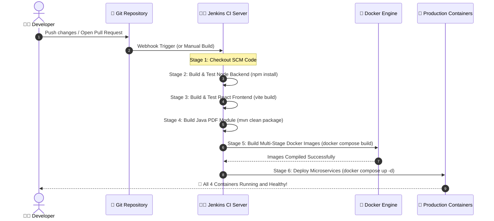

<div align="center">

# 🚀 PrepHub — AI-Powered Microservices Platform & CI/CD Pipeline

**An enterprise-grade, AI-driven technical preparation and career platform built on a containerized Microservices Architecture utilizing Docker, Jenkins, Maven, GitHub Actions, and the MERN Stack.**

[](./Jenkinsfile)
[](./docker-compose.yml)
[](./Jenkinsfile)
[](#-microservices-architecture--containerization)
[](https://ai.google.dev/)
[](https://opensource.org/licenses/MIT)

<br />

[](skillicons.dev)

</div>

---

## 📖 Table of Contents

- [🌟 Project Overview](#-project-overview)
- [🖼️ System Architecture & Visual Diagrams](#-system-architecture--visual-diagrams)
- [✨ Key Features](#-key-features)
- [🏗️ Microservices Architecture & Containerization](#-microservices-architecture--containerization)
- [🔄 CI/CD Automation & DevOps Pipeline](#-cicd-automation--devops-pipeline)
- [🛠️ Comprehensive Tech Stack & Tooling](#-comprehensive-tech-stack--tooling)
- [🚀 Installation & Quick Start](#-installation--quick-start)
  - [Option 1: Quick Start with Docker Compose (Recommended)](#option-1-quick-start-with-docker-compose-recommended)
  - [Option 2: Local Manual Development Setup](#option-2-local-manual-development-setup)
- [📁 Project Structure](#-project-structure)
- [🤝 Contributing](#-contributing)
- [📄 License](#-license)

---

## 🌟 Project Overview

**PrepHub** bridges the gap between modern software engineering and cloud-native DevOps operations. At its core, PrepHub is a comprehensive, AI-powered career platform designed to help developers and students practice coding with real-time AI feedback, prepare for technical interviews, build ATS-friendly resumes, network with peers, and apply for jobs all in one unified ecosystem.

To ensure high availability, scalability, and automated deployments, PrepHub is engineered as a **multi-container microservices application** orchestrated by **Docker Compose**, automated with **Jenkins CI/CD Declarative Pipelines**, and integrated with **GitHub Actions** and **Maven** build lifecycles.

---

## 🖼️ System Architecture & Visual Diagrams

### 1. PrepHub Microservices & Docker Network Architecture

The application runs as isolated, decoupled containers across a dedicated Docker bridge network (`prephub-network`). Each microservice scales and operates independently:

<div align="center">
  
</div>

<br />



---

### 2. Automated CI/CD & DevOps Pipeline Flow

Every code commit goes through a comprehensive, multi-stage automated workflow driven by Jenkins and validated across cloud CI environments:

<div align="center">
  
</div>

<br />



---

## ✨ Key Features

### 🐳 Enterprise DevOps & Microservices CI/CD
- **Multi-Container Orchestration**: Clean separation of concerns with dedicated containers for Frontend, Backend, Database, and Java Maven modules.
- **Automated Declarative Pipelines**: End-to-end integration via Jenkins (`Jenkinsfile`) and GitHub Actions (`.github/workflows/ci.yml`).
- **Zero-Downtime Multi-Stage Builds**: Optimized production builds using Nginx for React asset serving and lightweight Java runtime containers.
- **Persistent Data Storage**: Docker volume mapping (`mongo-data:/data/db`) preserves database state across rebuilds and container restarts.

### 🧠 AI-Powered Coding Practice
- **Real-time Evaluation**: Write code in our integrated web editor and get immediate feedback powered by the **Google Gemini AI API (`@google/generative-ai`)**.
- **Smart Analytics**: AI checks for syntax errors, logical bugs, and suggests time/space complexity optimizations (`O(N)` vs `O(N^2)`).
- **Ideal Solutions**: Get optimal solutions and step-by-step logical explanations generated by AI when stuck.

### 👔 Interactive Interview Prep
- **Dynamic Questions**: AI generates role-specific technical interview questions based on your target position and difficulty preference.
- **Answer Evaluation**: Submit your responses and receive actionable feedback alongside ideal reference answers from our AI interviewer.

### 📄 ATS-Friendly Resume Builder
- **Dynamic Templates**: Create structured, professional resumes tailored for modern Applicant Tracking Systems (ATS).
- **Real-time Preview**: See your resume take shape dynamically as you type.
- **Document Management**: Upload and manage CV files seamlessly handled via `multer` and our PDF service.

### 🏢 Job Portal & ATS Tracking
- **Job Listings**: Explore curated job openings posted by verified recruiters and system administrators.
- **One-Click Apply**: Submit your profile and generated resume directly to active opportunities.
- **Status Tracking**: Live application status updates (`Pending`, `Accepted`, `Rejected`).
- **Admin Dashboard**: Dedicated portal for recruiters to review applicants, download CVs, and transition pipeline stages.

### 🌐 ConnectHub (Social Networking)
- **Professional Feed**: Share articles, technical milestones, and career achievements.
- **Interactive Engagement**: Like, comment, and engage with posts across the developer community.
- **Network Expansion**: Connect with peers and explore verified developer profiles.

### 🔐 User Management & Role-Based Security
- **Authentication & Authorization**: Secure login and registration flows with encrypted credentials.
- **Role Differentiation**: Distinct privileges between standard `Developers` and `Admins/Recruiters`.
- **Profile Customization**: Comprehensive management of bio, educational background, and professional roles.

---

## 🏗️ Microservices Architecture & Containerization

PrepHub is decomposed into **four specialized microservices** running inside Docker containers defined in `docker-compose.yml`:

| Microservice Container | Host / Container Port | Technology Stack | Role & Responsibility in Ecosystem |
| :--- | :---: | :--- | :--- |
| **`prephub-frontend`** | `80 : 80` | **React.js, Vite, Nginx** | Presentation layer serving single-page application UI using optimized multi-stage static build. |
| **`prephub-backend`** | `3000 : 3000` | **Node.js, Express.js** | Core API gateway handling REST routes, MongoDB transactions, file uploads, and Gemini AI queries. |
| **`prephub-mongodb`** | `27017 : 27017` | **Official MongoDB Image** | Persistent document database utilizing Docker volume (`mongo-data`) for data reliability. |
| **`prephub-pdf-service`**| `8082 : 8080` | **Java 11, Maven** | Standalone microservice demonstrating build automation and document processing lifecycles. |

### Docker Compose Highlights (`docker-compose.yml`)
- **Bridge Network**: All containers reside within the isolated `prephub-network`, enabling internal DNS discovery (e.g., `mongodb://db:27017/prephub`).
- **Order of Operations**: `depends_on` rules ensure the `db` container initializes fully before the `backend` server starts, preventing connection drops.
- **Security & Secrets**: `.dockerignore` files prevent local `.env` secrets from leaking into built container layers.

---

## 🔄 CI/CD Automation & DevOps Pipeline

PrepHub implements a complete, industrial-grade continuous integration and continuous delivery methodology combining local/on-prem automation with cloud workflows:

### 1. Jenkins Declarative Pipeline (`Jenkinsfile`)
Our automated build system executes structured stages on every commit:
1. **`Checkout Stage`**: Fetches the latest revision from the version control repository.
2. **`Build & Test Backend`**: Executes `npm install` inside the `server/` module to validate dependencies and run API unit checks.
3. **`Build & Test Frontend`**: Validates React packages and compiles production-ready bundles (`npm run build`) via Vite.
4. **`Build PDF Maven Service`**: Invokes the Maven compiler (`mvn clean package`) using Java 11 to generate executable JAR artifacts.
5. **`Build Docker Images`**: Executes `docker compose build` across all microservices, verifying Dockerfile layers and dependency caching.
6. **`Deploy Containers`**: Deploys the multi-container stack (`docker compose up -d`) with health monitoring.

### 2. GitHub Actions Cloud CI (`.github/workflows/ci.yml`)
Runs automated cloud checks on every pull request and commit targeting `main`:
- Pre-validates Node.js (`npm test`) and Java (`mvn test`) modules across cross-platform environments.
- Ensures all Docker files build without syntax or dependency errors before merging.

---

## 🛠️ Comprehensive Tech Stack & Tooling

| Category | Badges & Technologies | Description & Purpose |
| :--- | :--- | :--- |
| **DevOps & CI/CD** | [](https://docker.com) [](https://jenkins.io) [](https://github.com/features/actions) | Multi-container orchestration, automated declarative pipelines, and cloud CI workflows. |
| **Build Tools** | [](https://maven.apache.org/) [](https://vitejs.dev/) [](https://npmjs.com) | Java lifecycle packaging (`pom.xml`), blazing-fast React bundling, and Node dependency management. |
| **Frontend UI** | [](https://reactjs.org/) [](https://tailwindcss.com) [](https://nginx.org/) | Responsive web interfaces, glassmorphic design tokens, and high-performance reverse proxying. |
| **Backend API** | [](https://nodejs.org/) [](https://expressjs.com/) [](https://java.com) | RESTful API backend handling authentication, business logic, file processing, and microservice APIs. |
| **Database & Storage** | [](https://mongodb.com) [](https://mongoosejs.com/) [](https://github.com/expressjs/multer) | Document-oriented database with persistent Docker volumes (`mongo-data`) and multipart file uploads. |
| **Artificial Intelligence**| [](https://ai.google.dev/) | Cloud AI API powering real-time code reviews, complexity checks, and dynamic interview simulations. |

---

## 🚀 Installation & Quick Start

### Prerequisites
Ensure you have the following installed on your host system:
- **Docker & Docker Compose** (v2.0+) — *Required for microservice deployment*
- **Node.js** (v16+) & **npm** — *For local development without Docker*
- **Java JDK 11+** & **Apache Maven** — *For building the Java microservice locally*
- **Google Gemini API Key** — *Required for AI evaluation features*

### Option 1: Quick Start with Docker Compose (Recommended)

This single command builds and launches all four microservices automatically (`Frontend`, `Backend`, `MongoDB`, and `PDF Maven Service`):

#### 1. Clone the Repository
```bash
git clone https://github.com/Priyanshukumar23/PrepHub.git
cd PrepHub
```

#### 2. Configure Environment Secrets
Create a `.env` file in the project root:
```env
# Root Directory .env
GEMINI_API_KEY=your_gemini_api_key_here
PORT=3000
```

#### 3. Launch Microservices via Docker Compose
```bash
docker compose up --build -d
```

Verify that all containers are healthy:
```bash
docker ps
```
You should see all 4 services active (`prephub-frontend` on port `80`, `prephub-backend` on port `3000`, `prephub-mongodb` on port `27017`, and `prephub-pdf-service` on port `8082`).

---

### Option 2: Local Manual Development Setup

If you prefer running components directly without containerization:

#### 1. Install Dependencies
```bash
# Install Backend Dependencies
npm install

# Install Frontend Dependencies
cd client
npm install
cd ..

# Build Maven Service
cd pdf-maven-service
mvn clean package
cd ..
```

#### 2. Start Servers in Separate Terminals

**Terminal 1 (Backend API Server):**
```bash
node server.js
```

**Terminal 2 (React Frontend Dev Server):**
```bash
cd client
npm run dev
```

**Terminal 3 (Java Maven Service — Optional):**
```bash
cd pdf-maven-service
java -jar target/demo-maven-service-1.0-SNAPSHOT.jar
```

- **Frontend App**: Open `http://localhost:5173` (Vite) or `http://localhost:80` (Docker)
- **Backend API**: Running on `http://localhost:3000`
- **PDF Maven Service**: Running on `http://localhost:8082`

---

## 📁 Project Structure

```
PrepHub/
├── .github/
│   └── workflows/          # GitHub Actions CI Automation workflows
├── client/                 # React Frontend Microservice (Vite + Nginx)
│   ├── public/             # Static UI assets & CSS files
│   ├── src/
│   │   ├── components/     # Reusable React components
│   │   ├── pages/          # Dashboard, Solve, Network, Resume Maker, etc.
│   │   ├── data/           # Mock data and system constants
│   │   ├── App.jsx         # Main application routing
│   │   └── main.jsx        # React entry point
│   ├── Dockerfile          # Multi-stage Docker build for Nginx/React
│   └── package.json        # Frontend dependencies
├── images/                 # Architectural SVG & Pipeline diagrams
│   ├── architecture.svg    # Microservices & Docker bridge network diagram
│   └── cicd_pipeline.svg   # Jenkins & GitHub Actions DevOps pipeline flow
├── pdf-maven-service/      # Java 11 Maven Microservice
│   ├── src/                # Java source files and unit tests
│   ├── Dockerfile          # Standalone container setup for Java runtime
│   └── pom.xml             # Maven Project Object Model & dependencies
├── server/                 # Express Backend Microservice (API & AI Gateway)
│   ├── Dockerfile          # Node.js backend container definition
│   └── package.json        # Backend dependencies
├── uploads/                # Persistent directory for uploaded CVs and documents
├── .env                    # Environment variables & API Keys
├── .gitignore              # Git exclusions (.env, node_modules, target)
├── docker-compose.yml      # Multi-container Microservice orchestration
├── Jenkinsfile             # Declarative Jenkins CI/CD automation pipeline
├── Project_Report.md       # Comprehensive system architecture & DevOps documentation
├── README.md               # Project documentation (this file)
└── server.js               # Express API entry point & routes
```

---

## 🤝 Contributing

Contributions, bug reports, and architectural proposals are warmly welcomed!

1. **Fork** the project repository.
2. Create your feature branch (`git checkout -b feature/AmazingFeature`).
3. Commit your changes (`git commit -m 'Add some AmazingFeature'`).
4. Ensure all builds pass locally (`docker compose build` & `mvn test`).
5. Push to the branch (`git push origin feature/AmazingFeature`).
6. Open a **Pull Request** for review.

---

## 📄 License

This project is open-source and licensed under the **MIT License**.

<div align="center">
  <br />
  <b>Happy Coding, Building, and Automated Deploying! 🚀🐳⚡</b>
</div>